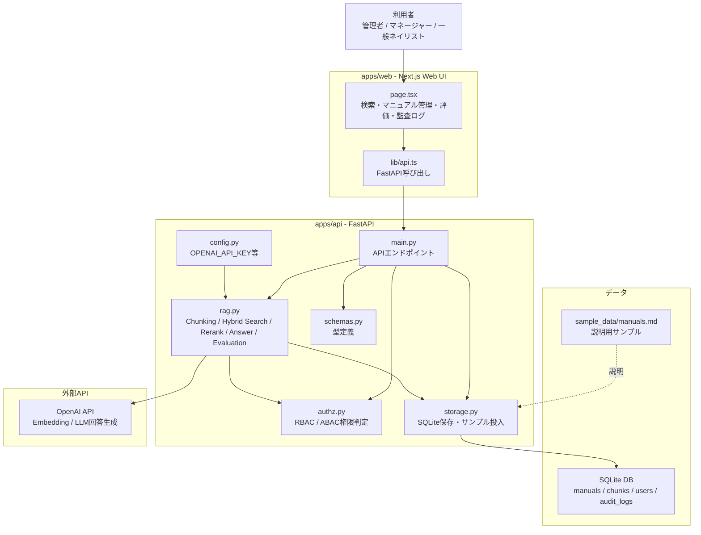
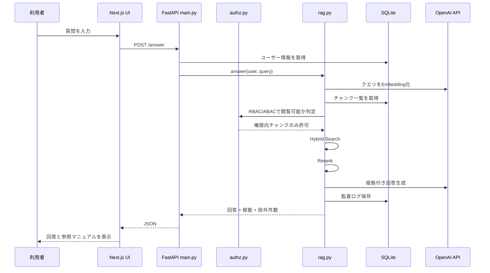
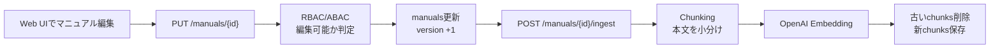

# Nail Knowledge RAG

ネイル会社の社内マニュアルを対象にした、RBAC/ABAC対応の社内ナレッジ検索AI WebAppです。

## 構成

- `apps/api`: FastAPI backend
- `apps/web`: Next.js frontend
- `sample_data`: ネイル会社向けサンプルマニュアルと評価データ

## 起動手順

### 1. OpenAI APIキー

APIキーは手動で設定します。秘密値はリポジトリにコミットしないでください。

```bash
cp apps/api/.env.example apps/api/.env
# apps/api/.env の OPENAI_API_KEY= に手動でキーを入れる
```

### 2. API

```bash
cd apps/api
python3 -m venv .venv
source .venv/bin/activate
pip install -r requirements.txt
uvicorn app.main:app --reload --port 8000
```

初回起動時にSQLite DBへサンプルユーザー、マニュアル、Golden Datasetを投入します。

### 3. Web

```bash
cd apps/web
npm install
npm run dev
```

Web UIは `http://localhost:3000`、APIは `http://localhost:8000` です。

## できること

- 管理者、本社マネージャー、支店マネージャー、一般ネイリストの切替
- RBAC/ABACに基づくマニュアル一覧、編集、検索
- Web UIからマニュアル本文・公開範囲・対象拠点を更新
- 更新後の再Embedding
- Hybrid Search、Rerank、根拠付き回答
- Recall、Precision、TopK Hit Rate、権限漏洩チェック
- 監査ログ確認

## 用語

- RBAC: 役割によって操作権限を決める方式です。
- ABAC: 所属拠点や文書属性など、属性によって追加判定する方式です。
- Chunking: 長い文書を検索しやすい小さな単位へ分割する処理です。
- Hybrid Search: ベクトル検索とキーワード検索を組み合わせる検索です。
- Rerank: 検索候補を質問との関連度順に並び替える処理です。
- Recall: 本来見つけるべき文書をどれだけ拾えたかです。
- Precision: 取得した文書のうち、正しい文書がどれだけ含まれるかです。
- Evaluation: 正解データで検索品質を継続的に測る仕組みです。

## アーキテクチャ図



## 検索・回答生成の流れ



## マニュアル更新の流れ



## 主要ファイル

| ファイル | 役割 |
|---|---|
| `apps/web/src/app/page.tsx` | 画面本体。検索、マニュアル編集、評価、監査ログを表示 |
| `apps/web/src/lib/api.ts` | FastAPIへのHTTP通信 |
| `apps/api/app/main.py` | API入口。`/answer`, `/manuals`, `/evaluations/run` など |
| `apps/api/app/authz.py` | RBAC/ABACの権限判定 |
| `apps/api/app/rag.py` | Chunking、Hybrid Search、Rerank、OpenAI回答生成、Evaluation |
| `apps/api/app/storage.py` | SQLite保存、サンプルユーザー/マニュアル投入 |
| `apps/api/app/schemas.py` | User、Manual、AnswerResponseなどの型定義 |
| `apps/api/app/config.py` | `.env` からOpenAI設定を読む |
| `apps/api/tests/test_authz_rag.py` | 権限制御テスト |
